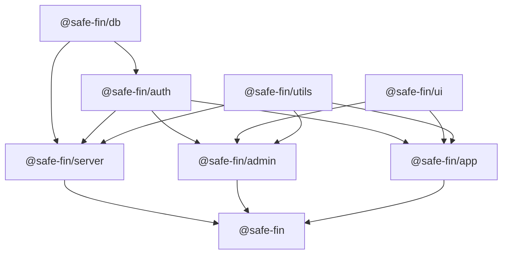

<p align="center">
  <picture>
    <source srcset="./banner-dark.png" media="(prefers-color-scheme: dark)">
    <source srcset="./banner.png" media="(prefers-color-scheme: light)">
    
  </picture>
  <h2 align="center">
    Safe Fin
  </h2>

  <p align="center">
    Interactive Financial Literacy & Fraud Awareness Platform
    <br />
    <a href="https://github.com/anmol-fzr/safe-fin/issues">Issues</a>
  </p>
</p>

[](https://deepwiki.com/anmol-fzr/safe-fin)

## About the project

SafeFin is a modern full-stack platform designed to make **financial education and fraud awareness** interactive and accessible.  
Built with cutting-edge technologies, it seamlessly integrates web, mobile, and serverless infrastructure for scalability and performance.

---

## 🌟 Features
- 📱 Cross-platform apps (Web + Mobile) with shared logic  
- 🔐 Secure authentication with role-based access and phone number OTP  
- 📊 Interactive quizzes, lessons, and progress tracking  
- ⚡ Serverless backend with edge database for global scale  
- 🎨 Beautiful, accessible UI with modern design systems  
- 📈 Built-in analytics and monitoring for continuous improvement  

---

## 🛠️ Tech Stack

### Frontend
- **React** – Admin dashboard  
- **React Native + Expo** – Mobile app  
- **Radix UI + shadcn/ui + Tailwind CSS** – Web UI components  
- **Tamagui** – Mobile UI system  

### Backend
- **Hono** – Web framework on **Cloudflare Workers**  
- **Drizzle ORM** – Type-safe queries  
- **Turso (LibSQL)** – Edge database  
- **Better Auth** – Authentication with plugins (OTP, Expo, Admin roles, Multi-session)  
- **Zod** – Validation  

### State & Data
- **TanStack Query** – Server state + caching  
- **Zustand** – Client state (Admin & Mobile)

### Tooling
- **TypeScript** – End-to-end type safety  
- **Bun** – Package manager  
- **TurboRepo** – Monorepo orchestration  
- **Biome** – Linting + formatting  
- **Syncpack** – Dependency management  

### Testing
- **Vitest** – Backend & web testing  
- **Jest** – React Native testing  
- **Testing Library** – UI testing  

### CI/CD & Deployment
- **Wrangler** – Deploy backend to Cloudflare Workers  
- **Cloudflare Pages** – Admin dashboard hosting  
- **Expo EAS Build** – Mobile app builds  

---

## 🏗️ Architecture & Patterns

- **Monorepo with Turbo** for modularity  
- **Serverless-first** backend with edge deployment  
- **Context Provider & Custom Hooks** for shared state  
- **Repository/Service Layer** for clean data access  
- **Compound Components** for flexible UI APIs  
- **Middleware Chain** in Hono for logging, CORS, caching, and etags  

---

## ⚡ Performance & Resilience
- HTTP caching with `Cache-Control` + `ETag`  
- Client-side caching with TanStack Query  
- React Error Boundaries for graceful failure  
- Secure storage with **Expo Secure Store**  
- CORS restricted to trusted origins  

---

## 📊 Monitoring & Analytics
- **PostHog** for product analytics  
- **React Native Logs** for mobile debugging  

---

## 🎨 UI/UX Highlights
- **Tiptap** – Rich text editing  
- **Sonner** – Toast notifications  
- **Skeleton loaders** – Smooth loading experience  
- **i18n** – Internationalization with React i18next  

---

## 🚀 Why SafeFin?
This project showcases:
- A **modern full-stack architecture** (React, React Native, Hono, Turso)  
- Strong focus on **developer experience** with TypeScript, Bun, and Turbo  
- **Scalable, serverless-first design** for global reach  
- Industry-standard **patterns & best practices**  
- Perfect balance of **DX, UX, and security**  

---

## 📂 Monorepo Structure

```bash
.
├── apps
│   ├── admin   # SafeFin's Admin Dashboard
│   ├── app     # SafeFin's Application
│   └── server  # SafeFin's Server
└── packages
    ├── auth
    ├── db
    ├── utils
    └── ui
```
3 applications, 4 packages




## Roadmap
- [ ] Automatic **Lesson**, creation
- [ ] Lesson **Recommendation**
- [ ] Add **Gamification**, challange-based learning
- [ ] Add **Regional Language Support** for financial literacy.  
- [ ] **Push Notifications** for fraud alerts.  
- [ ] Expand **calculator modules** for advanced financial planning.  
