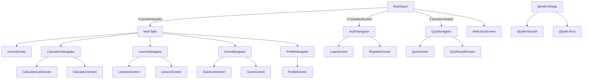

## About this package

The **SafeFin App** (`@safe-fin/app`) is the **mobile frontend** of the SafeFin platform, built with **React Native and Expo**.  
It brings interactive lessons, quizzes, financial calculators, and scam awareness tools directly to users’ phones, with a **smooth, responsive, and accessible experience**.  

This package depends on [**`@safe-fin/auth`**](https://github.com/anmol-fzr/safe-fin/tree/dev/packages/auth) for authentication flows and [**`@safe-fin/ui`**](https://github.com/anmol-fzr/safe-fin/tree/dev/packages/ui) for shared UI components.

---

## 🌟 Features
- 📱 **Cross-platform mobile app** (iOS + Android)  
- 🔐 **Secure login & authentication** with OTP via Better Auth  
- 📊 **Interactive financial lessons, quizzes, and progress tracking**  
- 💰 **Financial calculators** for personal finance planning  
- 🛡️ **Scam awareness and reporting tools**  
- ⚡ Optimized for **offline caching and fast navigation**  

---

## 🛠️ Tech Stack

### Core
- **React Native + Expo** – Cross-platform app framework  
- **TypeScript** – End-to-end type safety  

### State & Data
- **Zustand** – Local client state management  
- **TanStack Query** – Server state, caching, and async data fetching  

### Navigation
- **React Navigation (Stack + Tabs)** – Modular navigator architecture  
- **Suspense + TanStack Query** – Data-driven lazy loading of screens  

### Utilities
- **React Native Reanimated** – Smooth animations  
- **Expo Secure Store** – Secure local storage  
- **i18next** – Internationalization  

### Testing
- **Jest + Testing Library** – Unit & integration testing  
- **Vitest** – Optional lightweight testing for shared logic  

---

## 🏗️ Architecture & Patterns
- **Modular navigator structure** for screens & features  
- **Custom hooks** for shared logic and server queries  
- **Repository/Service layer** for network and database interactions  
- **Middleware for error handling, logging, and offline caching**  
- **Compound components** for reusable UI patterns  

---

## ⚡ Performance & Resilience
- **TanStack Query caching** for offline-first experience  
- **React Suspense** for screen-level data fetching  
- **Skeleton loaders & placeholders** for smooth UX  
- **Error boundaries** for graceful failure handling  
- **Secure storage** for sensitive data  

---

## 📊 Screens & Navigation Overview

The following Mermaid graph shows the **navigator hierarchy** of `@safe-fin/app` along with its **package dependencies**:

## Roadmap
- [ ] Add **Gamification**, challange-based learning
- [ ] Add **Regional Language Support** for financial literacy.  
- [ ] **Push Notifications** for fraud alerts.  
- [ ] Expand **calculator modules** for advanced financial planning.  
