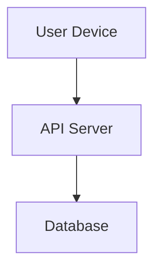
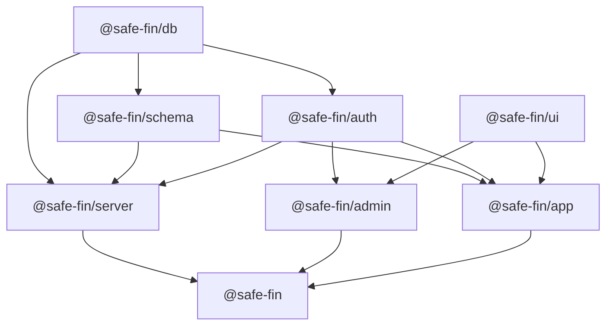

import { Tabs, TabItem } from '@astrojs/starlight/components';


<Tabs>
  <TabItem label="Stars">Sirius, Vega, Betelgeuse</TabItem>
  <TabItem label="Moons">Io, Europa, Ganymede</TabItem>
</Tabs>


SafeFin uses a modular serverless architecture that connects a cross-platform frontend with a lightweight API layer and distributed edge database. The system is designed to deliver interactive financial tools and learning experiences efficiently and securely.




### 1. **Core Components**
Each component gets a small paragraph. Mention **what** it does and **why** you chose it.

#### 🧭 Frontend Layer
- **Tech:** React Native + Expo
- **Purpose:** Renders lessons, calculators, and fraud awareness modules using a server-driven UI pattern.  
- **Why:** React Native for cross-platform capabilities + Server driven UI's

#### ⚙️ Backend Layer (API Gateway)
- **Tech:** Hono running on Cloudflare Workers.
- **Purpose:** Acts as the bridge between frontend and data — handles requests for lessons, calculators, and fraud data.  
- **Why:** Hono is minimal, fast, and natively supports edge deployments. It fits SafeFin’s goal of serverless scalability.

#### 🗃️ Database Layer
- **Tech:** Turso (distributed SQLite) + Drizzle ORM.  
- **Purpose:** Stores lessons, calculator definitions, fraud info, and user progress.  
- **Why:** Turso provides low-latency reads from the nearest edge region and uses familiar SQL semantics with lightweight management.

#### 🔐 Authentication Layer
- **Tech:** Better Auth  
- **Purpose:** Handles signup/login, session management, Authentication & Authorization
- **Why:** Chosen for simplicity, serverless compatibility, and native integration with Hono.

#### 📊 Analytics Layer
- **Purpose:** Collects anonymized insights about lesson completion, calculator usage, and fraud awareness quiz performance.  
- **Why:** Helps improve user experience and measure educational impact.

### 2. **Why This Architecture Works**
- **Scalability:** Each part (frontend, API, DB) scales independently due to serverless design.  
- **Performance:** Edge-first setup keeps latency low globally.  
- **Maintainability:** Monorepo setup with isolated packages (`/schema`, `/ui`, `/api`) improves reusability.  
- **Flexibility:** Server-driven UI allows new calculators or lessons to be added without redeploying frontend code.  
- **Security:** Auth + schema validation (Zod) + input sanitization for math expressions.

### 2. **Monorepo**
Offers Some nice set of features like
- **Code Sharing:** The Code is SafeFin is shared, react hooks similar in app and admin are kept in seperate package ui
- **Development:** Make Development easier, no need to configure bunch of tools, just a single script to start the whole setup

#### Monorepo structure
```
.
├── apps
│   ├── admin
│   ├── app
│   └── server
└── packages
    ├── auth
    ├── db
    ├── schema
    └── ui

```



